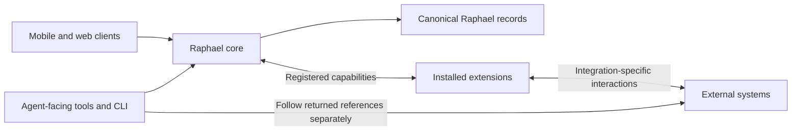

# System boundaries

Raphael provides a consistent organizational model for locally captured context and externally managed work. The architecture separates core guarantees from client and integration behavior.

## Moving pieces

[Runtime and access](./runtime-and-access.md) defines the single-owner server, client boundary, and initial backend direction. [Capture and media](./capture-and-media.md) defines local drafts and server-owned attachments.

## Responsibility ownership

| Concern                                                                   | Owner                                                                |
| ------------------------------------------------------------------------- | -------------------------------------------------------------------- |
| Entity identity, valid parents, and hierarchy integrity                   | Raphael core                                                         |
| Stored records and Get/List operations                                    | Raphael core                                                         |
| Scoped search coordination and result merging                             | Raphael core                                                         |
| Core mutation validation and enforcement of registered restrictions       | Raphael core                                                         |
| Archive causes and descendant cascade correctness                         | Raphael core                                                         |
| External mappings, provider-specific metadata, and synchronization policy | Extension                                                            |
| Optional external search within registered context                        | Extension                                                            |
| External content and provider-side operations                             | External system, accessed by the extension or a separate client tool |

Core storage ownership does not make Raphael authoritative for every synchronized field. An extension can require a field to be changed at its external source, while locally captured notes remain Raphael-owned.

## Extension boundary

Extensions are trusted backend code installed by the operator. They use core operations rather than replacing the entity model or universal retrieval APIs. [Model and capabilities](../extensions/model-and-capabilities.md) owns the trust and capability contract; [Hooks](../extensions/hooks.md) explains bounded participation and failure behavior.

Core also owns shared AI capabilities and provider routing under [ADR 0006](../adrs/0006-ai-capability-ownership.md).

## Deliberately unspecified

Extension loading, extension process isolation, private storage boundaries, settings schemas, route registration mechanisms, and custom rendering remain undecided. Hook scheduling and ordering remain open; trusted installation does not settle those choices.

See [Entities and relationships](./entities-and-relationships.md) for the organizational model and [Operations and lifecycle](./operations-and-lifecycle.md) for API boundaries.
