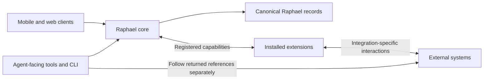

# System boundaries

Raphael provides a consistent organizational model for locally captured context and externally managed work. The architecture describes ownership independently of deployment, storage technology, or client framework.

## Moving pieces

Clients and agents access the same organizational meaning. A path-oriented CLI is an intended interface to Raphael, not a separate source of truth. Reading an external reference through Raphael does not automatically retrieve its external content.

## Responsibility ownership

| Concern                                                                   | Owner                                                                |
| ------------------------------------------------------------------------- | -------------------------------------------------------------------- |
| Entity identity, valid parents, and hierarchy integrity                   | Raphael core                                                         |
| Stored records and Get/List operations                                    | Raphael core                                                         |
| Scoped search coordination and result merging                             | Raphael core                                                         |
| Core mutation validation and enforcement of registered restrictions       | Raphael core                                                         |
| Archive causes and descendant cascade correctness                         | Raphael core                                                         |
| External mappings, provider-specific metadata, and synchronization policy | Extension                                                            |
| Optional external search within registered context                        | Extension                                                            |
| External content and provider-side operations                             | External system, accessed by the extension or a separate client tool |

Core storage ownership does not make Raphael authoritative for every synchronized field. An extension can require a field to be changed at its external source, while locally captured notes remain Raphael-owned.

## Extension boundary

Extensions are trusted backend code installed by the operator. They participate through a stable extension interface rather than replacing the core entity model or universal retrieval APIs.

Extensions can contribute resource kinds, settings, webhook/API handlers, reconciliation behavior, and optional search or mutation hooks. These capabilities do not require every extension to implement every operation. Core functionality remains useful without any extensions installed.

An installed extension being unavailable is different from no extension being configured. Core must retain awareness of applicable mutation restrictions rather than silently relaxing them when extension code cannot be reached.

## Deliberately unspecified

The extension loading mechanism, process topology, database technology, and private extension storage boundaries remain undecided. So do settings schemas, route registration details, custom rendering mechanisms, and hook delivery guarantees. Trusted installation does not settle those choices.

See [Entities and relationships](./entities-and-relationships.md) for the organizational model and [Operations and lifecycle](./operations-and-lifecycle.md) for API boundaries.
